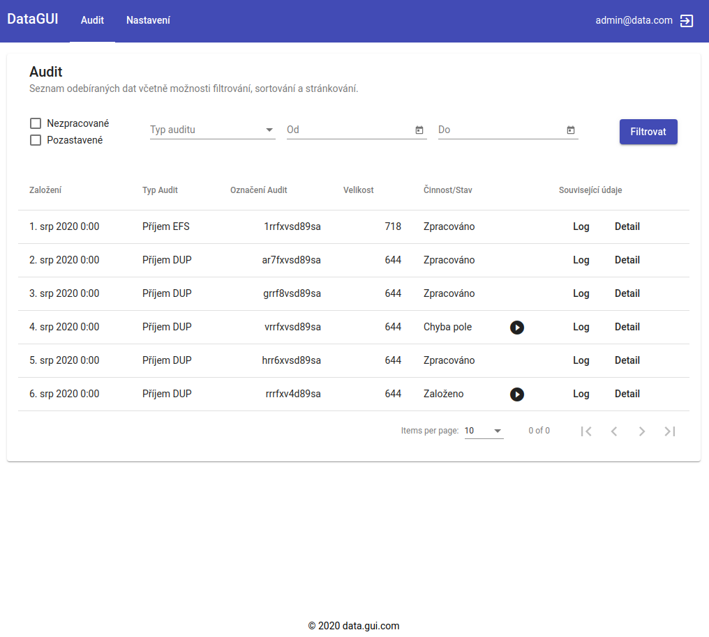
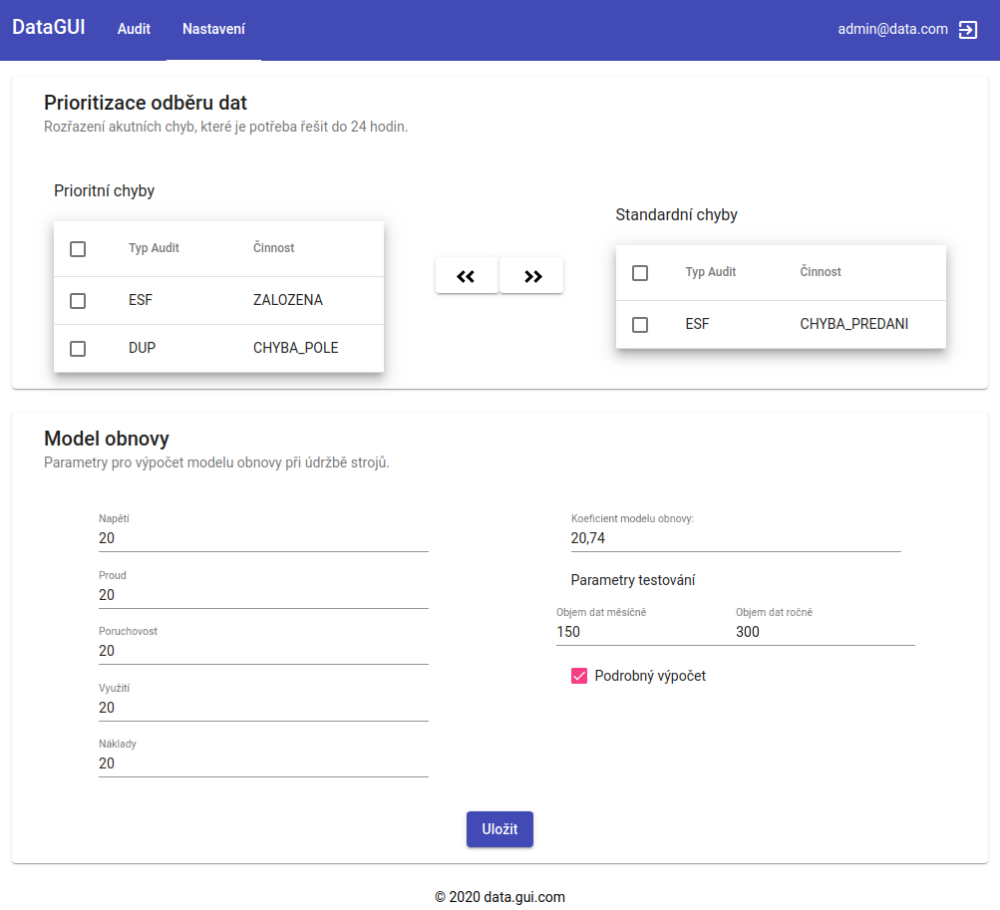

# Modern data-oriented GUI

- frontend application written in Angular 10
- simple content built with https://material.angular.io/

- audit
  - table with data from DB
  - filtering, sorting, paging

- nastaveni
  - swapping records between tables
  - form with validation

## Audit



## Nastaveni



## Run

```
npm install
```

```
ng serve
```